Welcome! 
This is a small summary of the Android/iOS version distribution across the UK and Worldwide.
The data represented in this page corresponds to the period between **Q1 2018 - Q1 2020**.
This website was last updated on *March 3rd, 2020*. 

### Contents
- [Mobile](#mobile)
	- [Mobile Operating System distribution](#mobile-operating-system-distribution)
	  - [UK Market Share](#mobile-os-uk)
	  - [Worldwide Market Share](#mobile-os-ww)
- [Tablet](#tablet)
	- [Tablet Operating System distribution](#tablet-operating-system-distribution)
	  - [UK Market Share](#tablet-os-uk)
	  - [Worldwide Market Share](#tablet-os-ww)
 - [Useful links](#useful-links)
  
  ---
  
## Mobile

### Mobile Operating System distribution

#### Mobile OS UK Market Share

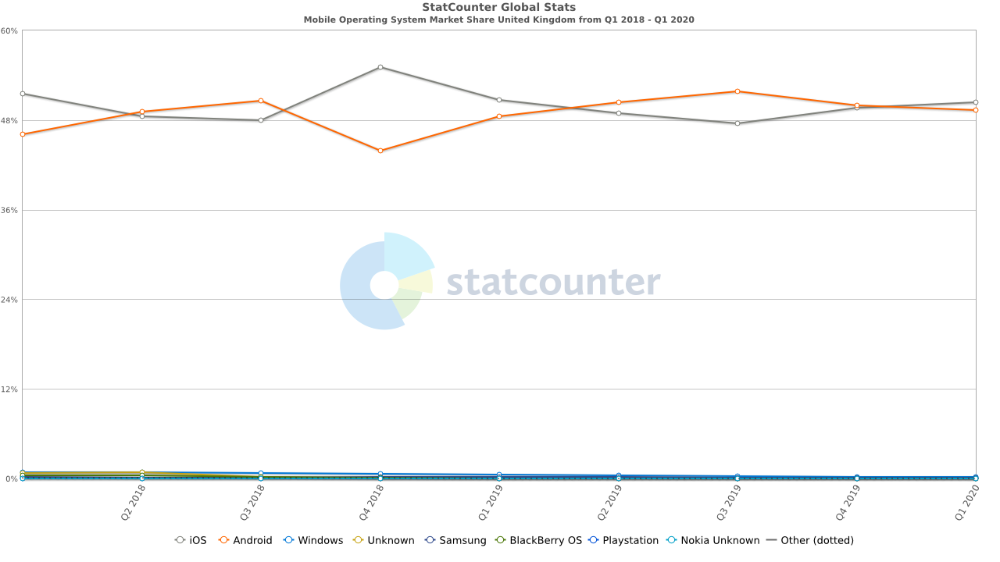
Source: [StatCounter Global Stats](https://gs.statcounter.com/os-market-share/mobile/united-kingdom/#quarterly-201801-202001)

##### Android
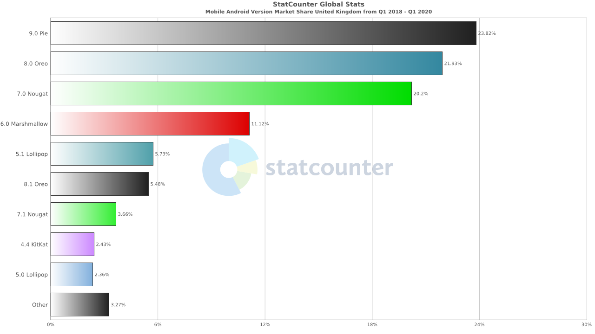
Source: [StatCounter Global Stats](https://gs.statcounter.com/android-version-market-share/mobile/united-kingdom/#quarterly-201801-202001-bar)
##### iOS
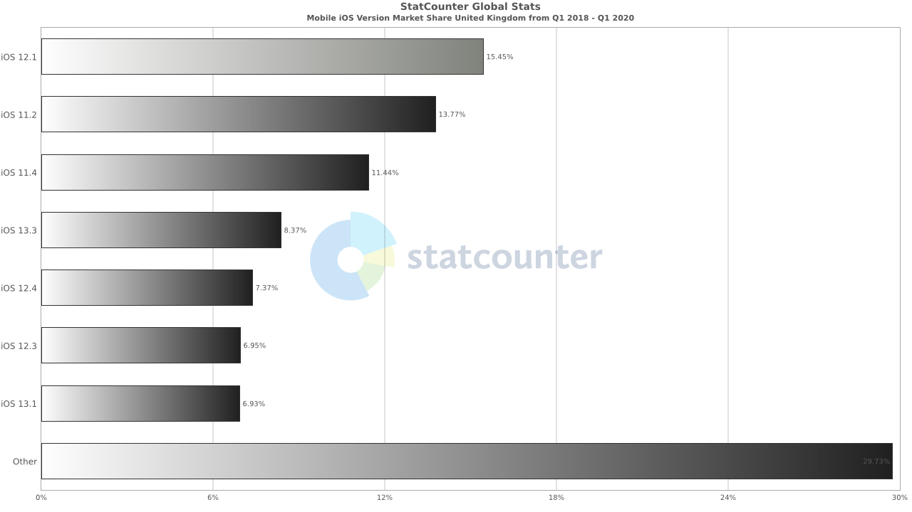
Source: [StatCounter Global Stats](https://gs.statcounter.com/ios-version-market-share/mobile/united-kingdom/#quarterly-201801-202001-bar)

---

#### Mobile OS Worldwide Market Share

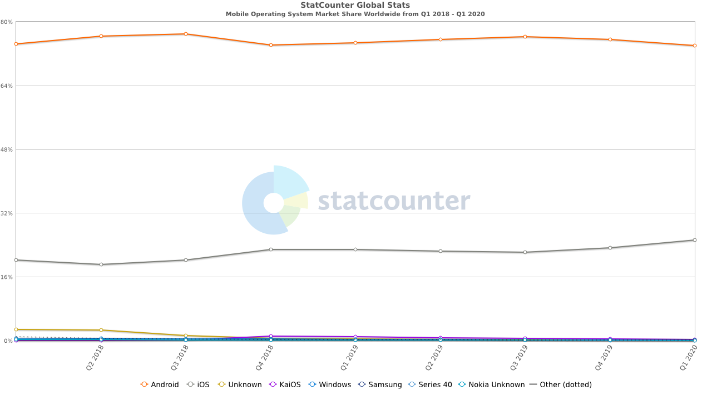
Source: [StatCounter Global Stats](https://gs.statcounter.com/os-market-share/mobile/worldwide/#quarterly-201801-202001)

##### Android
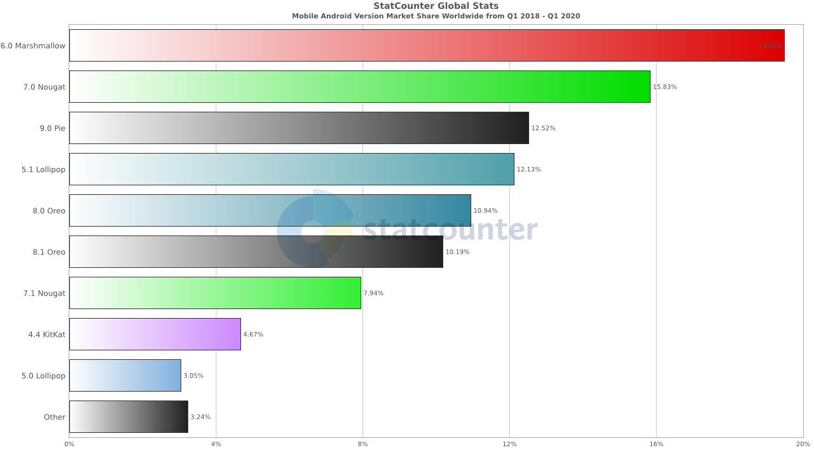
Source: [StatCounter Global Stats](https://gs.statcounter.com/android-version-market-share/mobile/worldwide/#quarterly-201801-202001-bar)

##### iOS
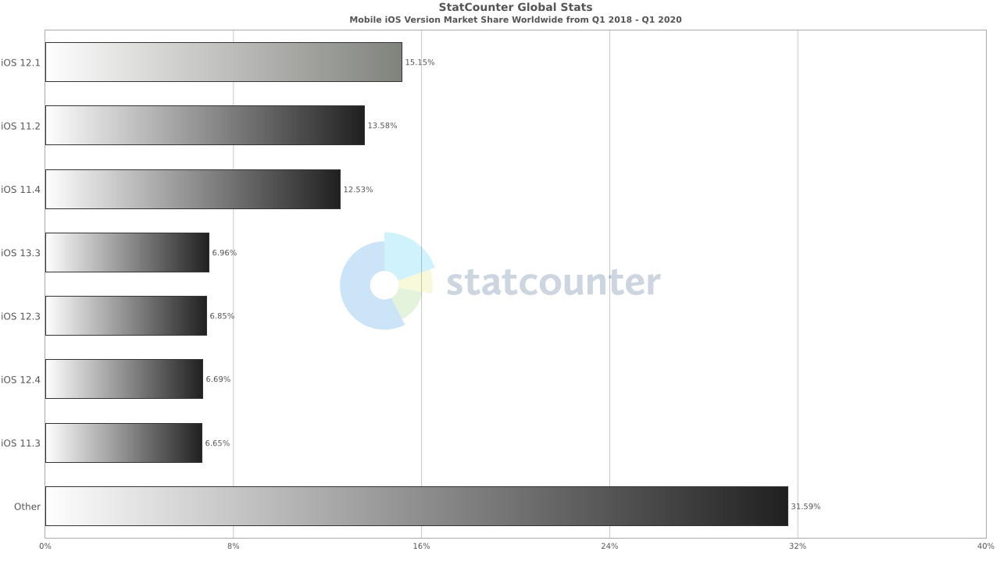
Source: [StatCounter Global Stats](https://gs.statcounter.com/ios-version-market-share/mobile/worldwide/#quarterly-201801-202001-bar)

## Tablet

### Tablet Operating System distribution

#### Tablet OS UK Market Share

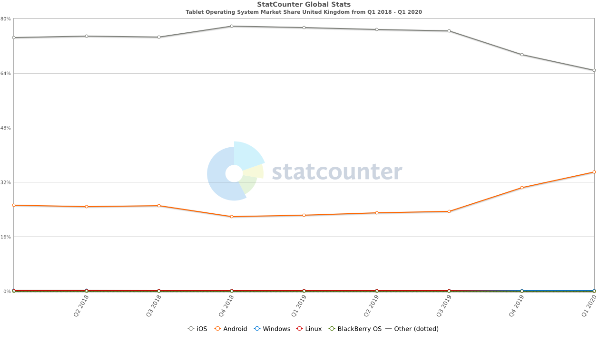
Source: [StatCounter Global Stats](https://gs.statcounter.com/os-market-share/tablet/united-kingdom/#quarterly-201801-202001)

##### Android
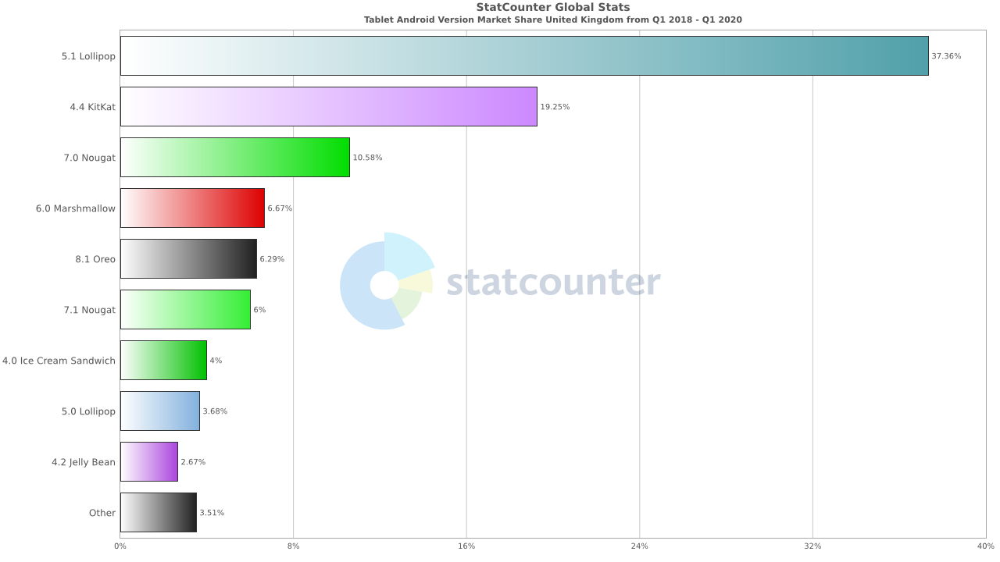
Source: [StatCounter Global Stats](https://gs.statcounter.com/android-version-market-share/tablet/united-kingdom/#quarterly-201801-202001-bar)

##### iOS
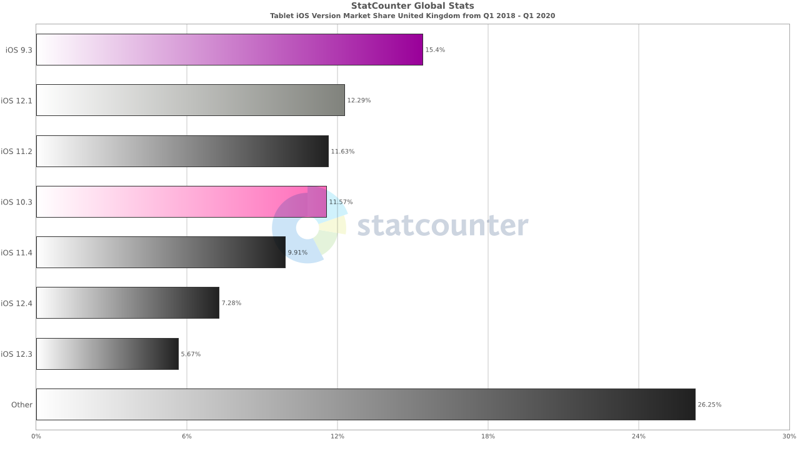
Source: [StatCounter Global Stats](https://gs.statcounter.com/ios-version-market-share/tablet/united-kingdom/#quarterly-201801-202001-bar)

---

#### Tablet OS Worldwide Market Share

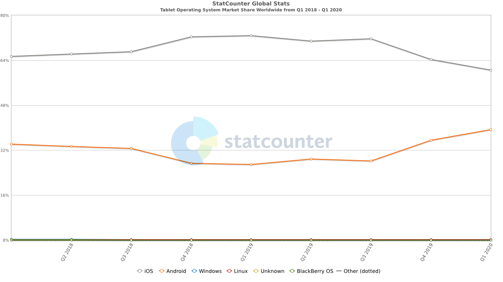
Source: [StatCounter Global Stats](https://gs.statcounter.com/os-market-share/tablet/worldwide/#quarterly-201801-202001)

##### Android
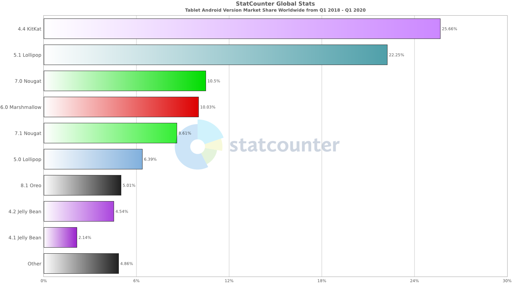
Source: [StatCounter Global Stats](https://gs.statcounter.com/android-version-market-share/tablet/worldwide/#quarterly-201801-202001-bar)

##### iOS
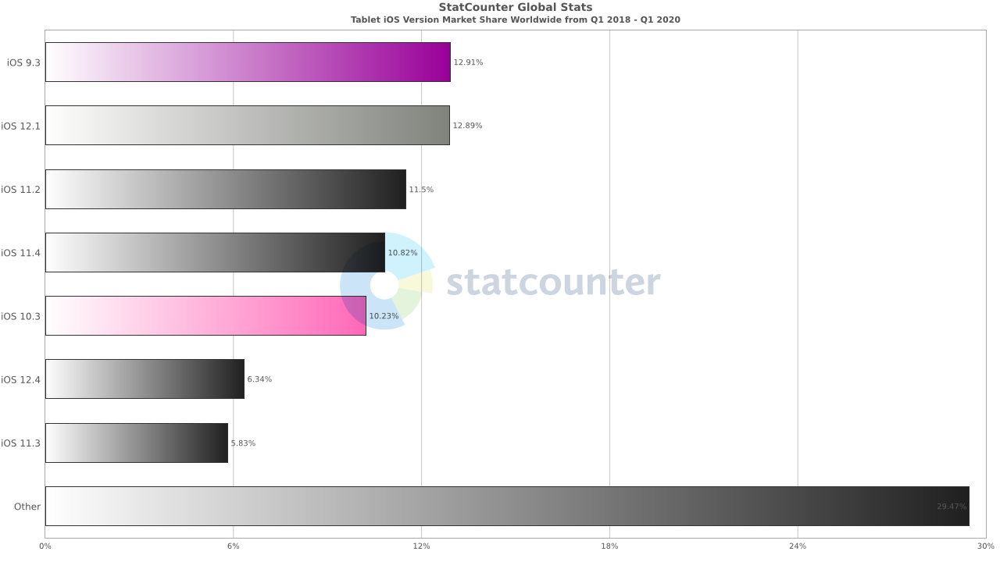
Source: [StatCounter Global Stats](https://gs.statcounter.com/ios-version-market-share/tablet/worldwide/#quarterly-201801-202001-bar)

## Useful links
- [https://developer.android.com/about/dashboards](https://developer.android.com/about/dashboards)
- [https://developer.apple.com/support/app-store/](https://developer.apple.com/support/app-store/)
- [https://david-smith.org/iosversionstats/](https://david-smith.org/iosversionstats/)
