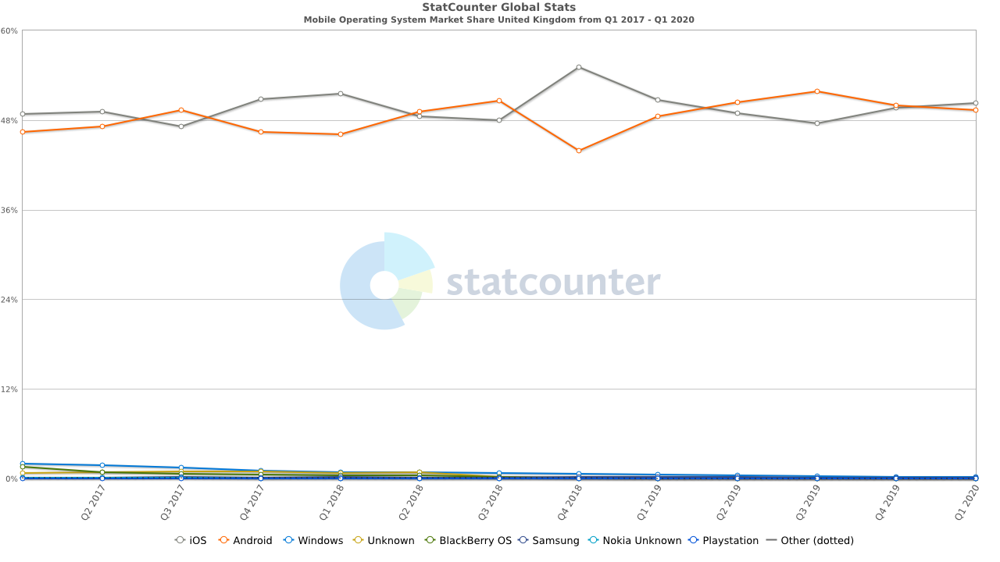
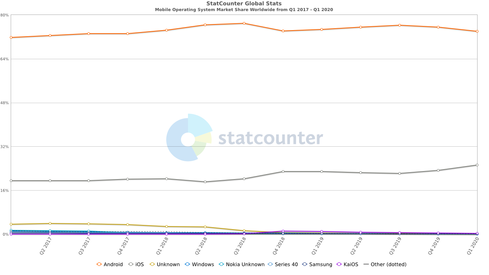
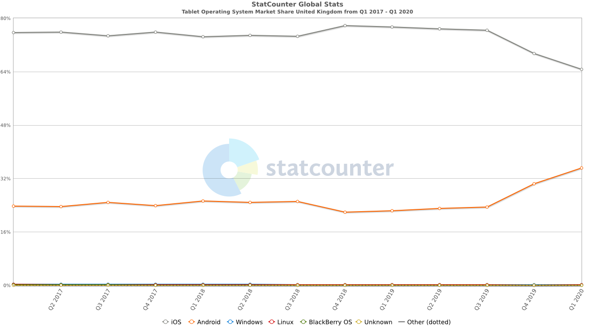
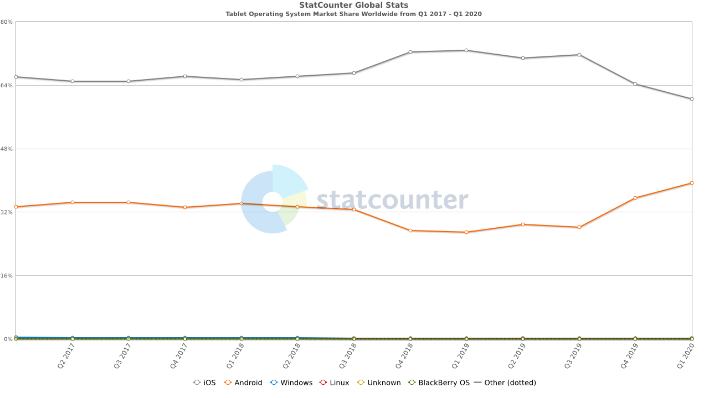

- [Mobile Operating System distribution](#mobile-operating-system-distribution)
  * [Mobile OS UK Market Share (Q1 2017 - Q1 2020)](#mobile-os-uk-market-share--q1-2017---q1-2020-)
  * [Mobile OS Worldwide Market Share (Q1 2017 - Q1 2020)](#mobile-os-worldwide-market-share--q1-2017---q1-2020-)
- [Tablet Operating System distribution](#tablet-operating-system-distribution)
  * [Tablet OS UK Market Share (Q1 2017 - Q1 2020)](#tablet-os-uk-market-share--q1-2017---q1-2020-)
  * [Tablet OS Worldwide Market Share (Q1 2017 - Q1 2020)](#tablet-os-worldwide-market-share--q1-2017---q1-2020-)
  
## Mobile Operating System distribution

### Mobile OS UK Market Share (Q1 2017 - Q1 2020)

||Android|iOS|
|:---:|:---:|:---:|
|Q1 2020|49.35%|**50.33%**|
|Q4 2019|**50.01%**|49.61%|
|Q3 2019|**51.85%**|47.6%|
|Q2 2019|**50.41%**|48.88%|

Source: [StatCounter Global Stats](https://gs.statcounter.com/os-market-share/mobile/united-kingdom/#quarterly-201701-202001)

### Mobile OS Worldwide Market Share (Q1 2017 - Q1 2020)

||Android|iOS|
|:---:|:---:|:---:|
|Q1 2020|**73.94%**|25.17%|
|Q4 2019|**75.56%**|23.24%|
|Q3 2019|**76.18%**|22.22%|
|Q2 2019|**75.52%**|22.5%|

Source: [StatCounter Global Stats](https://gs.statcounter.com/os-market-share/mobile/worldwide/#quarterly-201701-202001)

## Tablet Operating System distribution

### Tablet OS UK Market Share (Q1 2017 - Q1 2020)

||Android|iOS|
|:---:|:---:|:---:|
|Q1 2020|35.1%|**64.7%**|
|Q4 2019|30.37%|**69.45%**|
|Q3 2019|23.43%|**76.35%**|
|Q2 2019|22.9%|**76.73%**|

Source: [StatCounter Global Stats](https://gs.statcounter.com/os-market-share/tablet/united-kingdom/#quarterly-201701-202001)

### Tablet OS Worldwide Market Share (Q1 2017 - Q1 2020)

||Android|iOS|
|:---:|:---:|:---:|
|Q1 2020|39.25%|**60.51%**|
|Q4 2019|35.63%|**64.22%**|
|Q3 2019|28.09%|**71.88%**|
|Q2 2019|28.91%|**70.81%**|

Source: [StatCounter Global Stats](https://gs.statcounter.com/os-market-share/tablet/worldwide/#quarterly-201701-202001)
